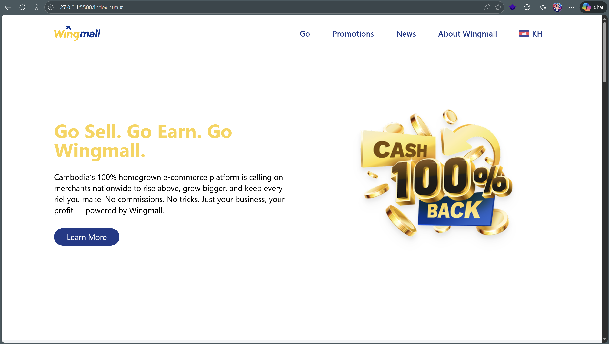

<!-- Student name -->
Kruy Kimhong (B2)
<!-- Project Title -->
Wingmall home page clone
<!-- Image and Font -->
I got image from Wingmall Website and Icon is from Font Awsome
<!-- To run this project you need to run this mpx command -->
to run this project you need to run (npx tailwindcss -i ./input.css -o ./output.css --watch)
or just open (index.html) with live server

<!-- Result -->
<!-- Mobile  -->
 

<!-- Desktop -->
